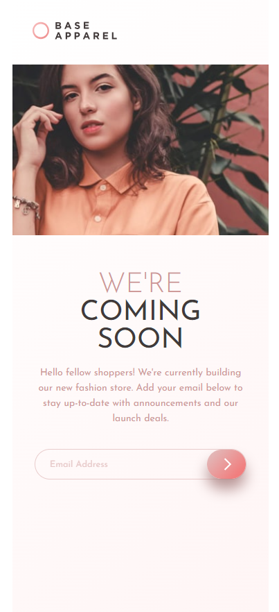
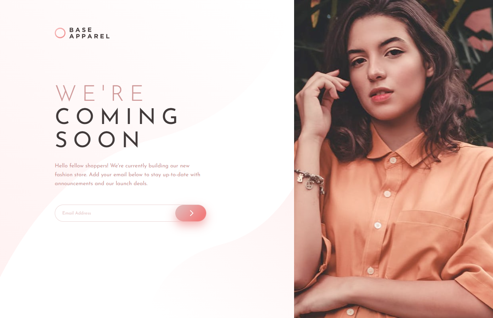

# Frontend Mentor - QR code component solution

---

This is a solution to the [Base Apparel Coming Soon](https://www.frontendmentor.io/challenges/base-apparel-coming-soon-page-5d46b47f8db8a7063f9331a0).

### Screenshot

### Links

- Solution URL: [https://github.com/Namonaki0/FE-mentor-base-apparel-coming-soon](https://github.com/Namonaki0/FE-mentor-base-apparel-coming-soon)
- Live Site URL: [https://fementor-af-base-apparel.netlify.app/](https://fementor-af-base-apparel.netlify.app/)

## My process

### Built with

- Semantic HTML5 markup
- SCSS custom properties
- Flexbox
- CSS Grid
- Mobile-first workflow
- Media Queries & Keyframes
- Vanilla JavaScript

Netlify used for deployment.

## Author

- Website - [https://www.andreferreiradev.com/](https://www.andreferreiradev.com/)
- Frontend Mentor - [https://www.frontendmentor.io/profile/Namonaki0](https://www.frontendmentor.io/profile/Namonaki0)
- Github - [https://github.com/Namonaki0](https://github.com/Namonaki0)
